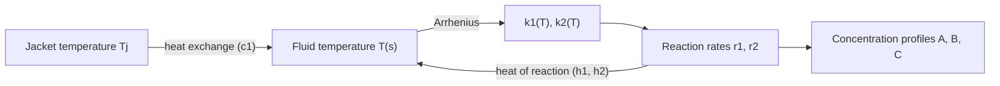
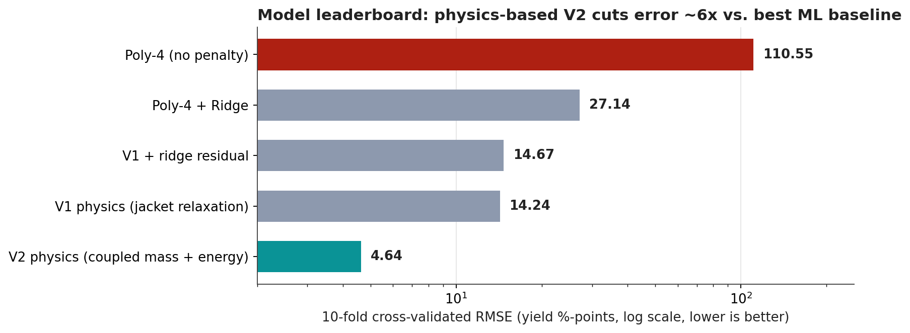

<div align="center">

# ⚗️ ReactorSense

### Grey-box yield prediction for a non-isothermal continuous-flow reactor
**First-principles reaction engineering + data-driven parameter estimation, validated with leakage-free cross-validation**


</div>

---

## 📌 TL;DR

| | |
|---|---|
| **Task** | Predict `overall_yield` (% of product **B** at the reactor exit) for unseen operating conditions |
| **Data** | 150 historical plant runs, 5 inputs, 50 held-out test conditions |
| **Metric** | RMSE (evaluated here as 10-fold **cross-validated** RMSE, everything refit inside each fold) |
| **Winning approach** | **V2**: coupled mass + energy balance for an A → B → C plug-flow reactor, solved with a vectorised RK4 integrator, 8 physical parameters fitted by multi-start non-linear least squares |
| **Result** | **CV RMSE 4.65** vs. 14.24 (V1 closed-form physics) vs. 27.15 (best pure-ML baseline, degree-4 polynomial + ridge) |

> **Core idea.** With 150 rows and 5 inputs, a flexible ML model has very little to learn from, while the chemistry of a tubular reactor is well understood. Instead of asking a black box to *rediscover* reaction kinetics, we write the kinetics down and let the data pin down only a handful of unknown constants.

---

## 🧪 1. Problem Statement

A continuous-flow reactor runs the **consecutive (series) reaction**

$$
A \xrightarrow{\;k_1\;} B \xrightarrow{\;k_2\;} C
$$

where **B** is the desired product and **C** is a loss. The reactor is **non-isothermal**: the fluid exchanges heat with a jacket, and the reactions themselves absorb or release heat.

**Inputs (5 operating variables)**

| Feature | Unit | Train range |
|---|---|---|
| `flow_rate_L_min` | L/min | 5.4 – 79.0 |
| `concentration_mol_L` (feed `C_A0`) | mol/L | 0.52 – 3.97 |
| `inlet_temperature_K` | K | 351.6 – 498.6 |
| `length_m` | m | 2.3 – 25.0 |
| `jacket_temperature_K` | K | 354.0 – 548.0 |

**Target:** `overall_yield` ∈ [0, 100] %, the fraction of feed converted to B at the outlet.

**Why it is hard**

- 150 samples is tiny for a 5-D non-linear response surface.
- Yield is **non-monotonic**: B is created first and consumed later, so pushing "more residence time" or "more heat" eventually *destroys* product.
- Temperature enters through `exp(−Ea/RT)`, so the two reactions respond with very different sensitivities.

---

## 🔍 2. Exploratory Data Analysis

<div align="center">

</div>

| Observation | Implication |
|---|---|
| The target is **strongly bimodal**: a large cluster at ≈ 0 % (over-processed or barely reacted runs) and a second cluster at 75–100 %. Median yield is 15.3 %. | Plain regression is pulled between two regimes; errors are dominated by the transition region. |
| No input is strongly linearly correlated with yield (the largest are jacket T at −0.50 and inlet T at −0.41; feed concentration is ≈ 0.01). | Linear and low-order models are structurally wrong. This is an interaction-driven, kinetic response. |
| Yield vs. `length / flow` rises then collapses, with colour (jacket temperature) separating the branches. | Classic **consecutive-reaction hump**: yield is governed by residence time *and* temperature jointly. |

---

## 🧠 3. Solution Architecture

We build a **model ladder**: each rung adds one piece of physics and is judged on cross-validated error.

### 3.1 Black-box baseline: polynomial regression

A degree-4 polynomial in 5 variables has **126 coefficients for 150 rows**.

- Unregularised: **CV RMSE = 110.5**. It interpolates noise and extrapolates wildly.
- + Ridge (penalty tuned by internal CV): **CV RMSE = 27.1**. Kept as the ML benchmark.

### 3.2 Model V1: closed-form plug-flow reactor (6 parameters)

For first-order series kinetics at a fixed temperature, the classic analytical result is

$$
\frac{C_B}{C_{A0}}=\frac{k_1}{k_2-k_1}\left(e^{-k_1\tau}-e^{-k_2\tau}\right)
$$

with

$$
\tau = c_0\frac{L}{Q},\qquad
T_{\mathrm{eff}} = T_j + (T_i - T_j)\,e^{-c_1 L/Q},\qquad
k_i = k_{i,\mathrm{ref}}\exp\!\left[-\frac{E_{a,i}}{R}\left(\frac{1}{T_{\mathrm{eff}}}-\frac{1}{T_{\mathrm{ref}}}\right)\right]
$$

- `c0` absorbs the unknown tube cross-section and unit conversions (residence time).
- `T_eff` is a heat-exchanger style relaxation toward the jacket temperature.
- Arrhenius rates are **re-centred on `T_ref`** (a re-parameterisation that removes the near-perfect `A`–`Ea` correlation and makes the optimiser well-conditioned).
- The removable singularity at `k1 ≈ k2` is handled analytically via its limit, `k1·τ·e^(−k1 τ)`.

**Result: CV RMSE = 14.24.** Already half the error of the best ML model, from only 6 numbers.

### 3.3 Model V2: coupled mass and energy balances (8 parameters)

V1 forces the fluid temperature to follow the jacket regardless of what the chemistry is doing. But in a real non-isothermal reactor there is a **feedback loop**:



With `s ∈ [0, 1]` the dimensionless axial coordinate and `τ = c₀·L/Q`:

$$
\frac{dC_A}{ds} = -\tau\,k_1(T)\,C_A
$$

$$
\frac{dC_B}{ds} = \tau\left[k_1(T)\,C_A - k_2(T)\,C_B\right]
$$

$$
\frac{dT}{ds} = \tau\left[c_1\,(T_j - T) + h_1\,k_1(T)\,C_A + h_2\,k_2(T)\,C_B\right]
$$

- `h1`, `h2` are **lumped heat-of-reaction terms** per unit rate for each step (sign tells whether the step cools or heats the fluid).
- V1 is the special case `h1 = h2 = 0`, so the V1 solution is used as one of the optimiser's starting points.
- No elementary closed form exists, so the system is marched with a **4th-order Runge-Kutta** scheme, **vectorised across all rows at once** (60 steps), with physical guards (no negative concentrations, bounded temperature, clipped exponents).
- Because `C_A0` now also scales the heat release, **feed concentration re-enters the model** through the energy balance. Under V1's first-order kinetics it cancelled out of the percentage yield entirely.

**Parameter estimation.** Arrhenius fits are riddled with local minima, so every fit uses **multi-start, bounded, trust-region non-linear least squares** (`scipy.optimize.least_squares`) with starting points drawn from a **scrambled Sobol quasi-Monte-Carlo sequence** for even coverage of the search box.

**Result: CV RMSE = 4.65**, a **67 % reduction** in error vs. V1 and **83 %** vs. the best ML baseline.

---

## 📊 4. Results

### 4.1 Model leaderboard

<div align="center">

</div>

| Rank | Model | Free params | 10-fold CV RMSE |
|:---:|---|:---:|:---:|
| 🥇 | **V2: coupled mass + energy balance (RK4)** | 8 | **4.645** |
| 🥈 | V1: closed-form PFR + jacket relaxation | 6 | 14.242 |
| 3 | V1 + ridge residual corrector (hybrid) | 6 + ML | 14.671 |
| 4 | Poly-4 + ridge | 126 (regularised) | 27.145 |
| 5 | Poly-4 (no penalty) | 126 | 110.545 |

> **Evaluation protocol.** Training error is far too optimistic on 150 points. For every model, *all* estimation steps (the six or eight physical constants, ridge penalties, residual correctors) are **refit from scratch inside each of the 10 folds** and scored only on the held-out fold. There is no information leakage from validation rows.

### 4.2 Fold-level stability

<div align="center">

</div>

V2 beats V1 on **9 of 10 folds**, and its worst fold (10.7, fold 6) is better than V1's average. V1's worst fold reaches 30.2.

### 4.3 Observed vs. predicted (training rows)

<div align="center">

</div>

V1 leaves large "false positive" errors on runs that are actually ~0 % yield (the over-cooked regime). V2 collapses these onto the parity line (train RMSE 14.64 → **4.08**, R² 0.854 → **0.989**). The cross-validated gap to 4.65 confirms the fit is not overfitting.

---

## 🔬 5. Process Insights

### 5.1 The reactor: what V2 says happens inside the tube

<div align="center">

</div>

*Illustrative run of the fitted V2 model at the training-median operating point.*

- **B is a transient product.** It peaks near the outlet and begins to decline as C accumulates, which is the series-reaction hump seen in the raw data.
- **Fitted heat terms have opposite signs** (`h1 = −11.1`, `h2 = +14.4`): the first step behaves as **endothermic** (cools the fluid) and the second as **exothermic** (heats it). The temperature trace shows exactly this, with an early dip followed by self-heating as B converts to C.
- That self-heating **accelerates the loss reaction precisely when B is most abundant**, which is why the trade-off between making B and losing B is so sharp.

### 5.2 Kinetic selectivity vs. temperature

<div align="center">

</div>

The loss reaction has a much higher activation energy than the desired one, so `k2` overtakes `k1` around **≈ 456 K**. Above this, each increment of heat destroys more product than it creates.

### 5.3 Operating window: the yield response surface

<div align="center">

</div>

*Model-generated, with flow rate, feed concentration and inlet temperature held at training medians.*

- A **high-yield ridge** sits at moderate jacket temperature (~400-425 K) and long reactor length.
- Above roughly 450 K there is a **sharp "over-cooking cliff"** where yield collapses to ~0 %, consistent with the ~43 % of training runs that land in the lowest yield bin.
- Shorter tubes require hotter jackets to compensate, but only within a narrow band before the cliff.

This is a practical, actionable picture for process engineers: where to run, and where not to.

---

## ❌ 6. A Negative Result (kept on purpose)

A popular idea is a **hybrid model**: keep the physics, let ML learn the residual. We tested it on V1 without leakage (per-fold V1 constants → training residuals → ridge on degree-2 polynomial features → add to held-out prediction).

| | CV RMSE |
|---|:---:|
| V1 alone | 14.24 |
| V1 + ML residual corrector | 14.67 (**worse**) |

Together with near-zero residual/input correlations (all |r| < 0.09), this shows the missing ingredient was **not statistical flexibility but missing physics** (the internal energy balance). That diagnosis directly motivated V2. It also confirms that for first-order kinetics the *percentage* yield is independent of `C_A0` under V1 (a free reaction order on `C_A0` only moved RMSE from ≈ 14.6 to ≈ 14.3, no better than one extra parameter fitting noise).

---

## ⚠️ 7. Limitations and Honest Caveats

- **Validity envelope.** The model is calibrated on 150 runs and is only guaranteed within the training range of operating conditions. A number of test points predict at the lower physical bound (0 %), and such out-of-envelope points should be flagged and reviewed before use.
- **Parameter at a bound.** The fitted `Ea2` sits **exactly on its upper search bound (200 kJ/mol)**. This suggests weak identifiability of the loss-reaction activation energy from this data; the selectivity crossover in §5.2 should be read qualitatively, and the bound should be widened and re-tested.
- **Lumped constants.** `c0`, `c1`, `h1`, `h2` absorb unmeasured geometry and thermal properties. Treat them as **effective calibration constants**, not exact physical quantities.
- **Model assumptions.** First-order kinetics, ideal plug flow (no axial back-mixing or radial gradients).
- **Uncertainty.** Predictions are point estimates; no confidence intervals yet.

---

## 🚀 8. Future Work

- [ ] **Uncertainty quantification**: bootstrap resampling or profile likelihood for parameter and prediction intervals
- [ ] **Identifiability and sensitivity analysis**: Jacobian-based and Sobol global sensitivity; re-fit with relaxed `Ea2` bounds
- [ ] **Stronger data-driven benchmarks**: gradient boosting, Gaussian-process regression
- [ ] **Physics-informed hybrids**: learned closures inside the ODE (universal differential equations / neural ODE residuals)
- [ ] **Out-of-distribution guardrails**: input-range monitoring and drift detection for production use
- [ ] **Model-based optimisation**: use V2 as a fast surrogate to search for the yield-maximising operating point

---

## 🗂️ 9. Repository Structure

```
Reactor_AI/
├── Chemical_Solution.ipynb     # full analysis: EDA → baselines → V1 → V2 → CV → predictions
├── README.md
├── requirements.txt
├── .gitignore
└── assets/                     # figures used in this README
    ├── 01_pipeline.png
    ├── 02_model_leaderboard.png
    ├── 03_cv_fold_stability.png
    ├── 04_reactor_profiles.png
    ├── 05_arrhenius_selectivity.png
    ├── 06_yield_response_surface.png
    ├── 07_eda_distribution.png
    └── 08_parity_v1_vs_v2.png
```

## ▶️ 10. Reproduce

```bash
git clone https://github.com/DebasishKaran-1/Reactor_AI.git
cd Reactor_AI
pip install -r requirements.txt
```

The notebook reads the challenge CSVs from a folder named `Reactor AI/`:

```
Reactor AI/train_dataset.csv     # 150 rows, 5 features + overall_yield
Reactor AI/test_dataset.csv      # 50 rows, 5 features
```

Then run `jupyter notebook Chemical_Solution.ipynb`. Running all cells refits V1/V2 (multi-start), performs the 10-fold CV, and writes `reactor_yield_predictions.csv` (50 rows, single `overall_yield` column). Seeds are fixed for reproducibility. The V2 multi-start fit and its CV loop are the slowest cells.

## 🧰 11. Tech Stack and Methods

| Area | Tools / Concepts |
|---|---|
| Modelling paradigm | Grey-box / mechanistic modelling, hybrid physics + ML, scientific machine learning |
| Reaction engineering | Plug-flow reactor (PFR), consecutive first-order kinetics, Arrhenius temperature dependence, coupled mass and energy balances, selectivity vs. temperature |
| Numerics | Vectorised fixed-step RK4 ODE integration, removable-singularity handling |
| Parameter estimation | Bounded trust-region non-linear least squares, Sobol quasi-Monte-Carlo multi-start, re-parameterisation for conditioning |
| Validation | 10-fold CV with in-fold refitting (leakage-free), fold-level stability analysis, ablation incl. negative result |
| Stack | Python, NumPy, SciPy, pandas, scikit-learn, Matplotlib |

---

<div align="center">

**Takeaway:** when data is scarce and the mechanism is known, *encode the mechanism*. Eight physically meaningful parameters outperformed a 126-term polynomial by ~6×, and explain *why* the reactor behaves as it does.

</div>
