<h1 align="center">Reactor AI</h1>

<p align="center"><b>Predicting reactor yield by encoding the chemistry and letting the data fix the constants.</b></p>

<p align="center">
  
  
  
  
  
</p>

<p align="center">
  <a href="#1-problem-statement">Problem</a> &nbsp;|&nbsp;
  <a href="#2-exploratory-data-analysis">EDA</a> &nbsp;|&nbsp;
  <a href="#3-solution-architecture">Solution</a> &nbsp;|&nbsp;
  <a href="#4-results">Results</a> &nbsp;|&nbsp;
  <a href="#5-process-insights">Insights</a> &nbsp;|&nbsp;
  <a href="#7-limitations">Limitations</a> &nbsp;|&nbsp;
  <a href="#10-reproduce">Reproduce</a>
</p>

---

## Overview

<p align="center">
  
</p>

| | |
|---|---|
| **Task** | Predict `overall_yield` (% of product **B** at the reactor exit) for unseen operating conditions |
| **Data** | 150 historical plant runs with 5 operating inputs; 50 held-out test conditions |
| **Metric** | RMSE, reported as 10-fold **cross-validated** RMSE with every fit repeated inside each fold |
| **Final model** | **V2**: coupled mass and energy balance for an A to B to C plug-flow reactor, solved with a vectorised RK4 integrator; 8 physical parameters estimated by multi-start non-linear least squares |
| **Outcome** | CV RMSE **4.645**, against 14.242 for closed-form physics (V1) and 27.145 for the best pure-ML baseline |

> **Core idea.** With 150 rows and 5 inputs, a flexible ML model has very little to learn from, while the chemistry of a tubular reactor is well understood. Rather than asking a black box to rediscover reaction kinetics, we write the kinetics down and let the data pin down only a handful of unknown constants.

<p align="center">
  
</p>

---

## 1. Problem Statement

A continuous-flow reactor runs the **consecutive (series) reaction**

$$
A \xrightarrow{\;k_1\;} B \xrightarrow{\;k_2\;} C
$$

where **B** is the desired product and **C** is a loss. The reactor is **non-isothermal**: the fluid exchanges heat with a jacket, and the reactions themselves absorb or release heat.

**Inputs**

| Feature | Unit | Training range |
|---|---|---|
| `flow_rate_L_min` | L/min | 5.4 to 79.0 |
| `concentration_mol_L` (feed `C_A0`) | mol/L | 0.52 to 3.97 |
| `inlet_temperature_K` | K | 351.6 to 498.6 |
| `length_m` | m | 2.3 to 25.0 |
| `jacket_temperature_K` | K | 354.0 to 548.0 |

**Target:** `overall_yield` in [0, 100] %, the fraction of feed converted to B at the outlet.

**Why it is hard**

- 150 samples is small for a 5-dimensional non-linear response surface.
- Yield is **non-monotonic**: B is created first and consumed later, so more residence time or more heat eventually destroys product.
- Temperature enters through `exp(-Ea/RT)`, so the two reactions respond with very different sensitivities.

---

## 2. Exploratory Data Analysis

<p align="center">
  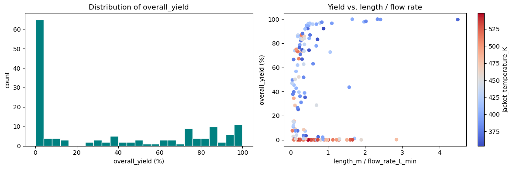
</p>

| Observation | Implication |
|---|---|
| The target is **strongly bimodal**: a large cluster near 0 % (over-processed or barely reacted runs) and a second cluster at 75 to 100 %. The median yield is 15.3 %. | A single regression surface is pulled between two regimes; errors concentrate in the transition region. |
| No input is strongly linearly correlated with yield. The largest are jacket temperature (-0.50) and inlet temperature (-0.41); feed concentration is about 0.01. | Linear and low-order models are structurally wrong. The response is interaction-driven and kinetic. |
| Yield versus `length / flow` rises and then collapses, with jacket temperature separating the branches. | This is the classic consecutive-reaction hump: yield depends on residence time and temperature jointly. |

---

## 3. Solution Architecture

<p align="center">
  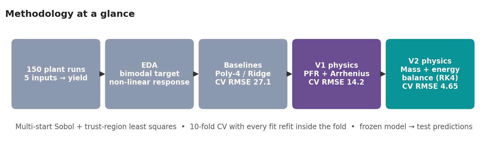
</p>

The solution is a **model ladder**. Each rung adds one piece of physics and is judged on cross-validated error.

### 3.1 Black-box baseline: polynomial regression

A degree-4 polynomial in 5 variables has **126 coefficients for 150 rows**.

- Unregularised: **CV RMSE 110.545**. It interpolates noise and extrapolates wildly.
- With ridge regularisation (penalty tuned by internal CV): **CV RMSE 27.145**. This is the ML benchmark.

### 3.2 Model V1: closed-form plug-flow reactor (6 parameters)

For first-order series kinetics at a fixed temperature, the classic analytical result is

$$
\frac{C_B}{C_{A0}}=\frac{k_1}{k_2-k_1}\left(e^{-k_1\tau}-e^{-k_2\tau}\right)
$$

with

$$
\tau = c_0\frac{L}{Q},\qquad
T_{\mathrm{eff}} = T_j + (T_i - T_j)\,e^{-c_1 L/Q},\qquad
k_i = k_{i,\mathrm{ref}}\exp\!\left[-\frac{E_{a,i}}{R}\left(\frac{1}{T_{\mathrm{eff}}}-\frac{1}{T_{\mathrm{ref}}}\right)\right]
$$

- `c0` absorbs the unknown tube cross-section and unit conversions (residence time).
- `T_eff` is a heat-exchanger style relaxation toward the jacket temperature.
- Arrhenius rates are **re-centred on `T_ref`**. This re-parameterisation removes the near-perfect correlation between the pre-exponential factor and `Ea` and makes the optimiser well-conditioned.
- The removable singularity at `k1 = k2` is handled analytically through its limit, `k1 * tau * exp(-k1 * tau)`.

**Result: CV RMSE 14.242**, roughly half the error of the best ML model from only 6 parameters.

### 3.3 Model V2: coupled mass and energy balances (8 parameters)

V1 forces the fluid temperature to follow the jacket regardless of the chemistry. In a real non-isothermal reactor there is a feedback loop:

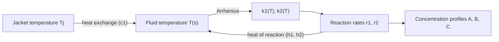

<p align="center">
  
</p>

With `s` in [0, 1] the dimensionless axial coordinate and `tau = c0 * L / Q`:

$$
\frac{dC_A}{ds} = -\tau\,k_1(T)\,C_A
$$

$$
\frac{dC_B}{ds} = \tau\left[k_1(T)\,C_A - k_2(T)\,C_B\right]
$$

$$
\frac{dT}{ds} = \tau\left[c_1\,(T_j - T) + h_1\,k_1(T)\,C_A + h_2\,k_2(T)\,C_B\right]
$$

- `h1` and `h2` are **lumped heat-of-reaction terms** for each step; their sign states whether the step cools or heats the fluid.
- V1 is the special case `h1 = h2 = 0`, so the V1 solution is one of the optimiser's starting points.
- There is no elementary closed form, so the system is integrated with a **4th-order Runge-Kutta** scheme, **vectorised across all rows at once** (60 steps), with physical guards: no negative concentrations, bounded temperature, clipped exponents.
- Because `C_A0` now scales the heat release, **feed concentration re-enters the model** through the energy balance. Under V1's first-order kinetics it cancels out of the percentage yield.

**Parameter estimation.** Arrhenius fits contain many local minima, so every fit uses **multi-start, bounded, trust-region non-linear least squares** (`scipy.optimize.least_squares`) with starting points drawn from a **scrambled Sobol quasi-Monte-Carlo sequence** for even coverage of the search box.

**Result: CV RMSE 4.645**, a **67 %** reduction in error versus V1 and **83 %** versus the best ML baseline.

---

## 4. Results

### 4.1 Model leaderboard

<p align="center">
  
</p>

| Rank | Model | Free parameters | 10-fold CV RMSE |
|:---:|---|:---:|:---:|
| 1 | **V2: coupled mass and energy balance (RK4)** | 8 | **4.645** |
| 2 | V1: closed-form PFR with jacket relaxation | 6 | 14.242 |
| 3 | V1 with ridge residual corrector (hybrid) | 6 + ML | 14.671 |
| 4 | Polynomial-4 with ridge | 126 (regularised) | 27.145 |
| 5 | Polynomial-4 (no penalty) | 126 | 110.545 |

> **Evaluation protocol.** Training error is far too optimistic on 150 points. For every model, all estimation steps (the six or eight physical constants, ridge penalties, residual correctors) are **refit from scratch inside each of the 10 folds** and scored only on the held-out fold. No information leaks from validation rows.

### 4.2 Fold-level stability

<p align="center">
  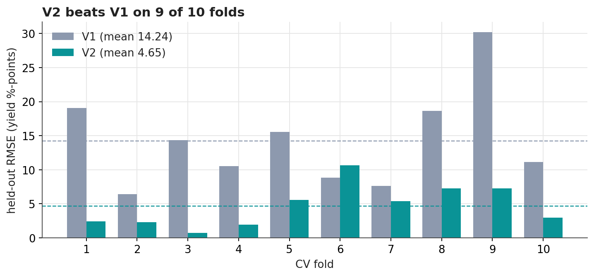
</p>

V2 beats V1 on **9 of 10 folds**. Its worst fold (10.7, fold 6) is better than V1's average, while V1's worst fold reaches 30.2.

### 4.3 Observed versus predicted (training rows)

<p align="center">
  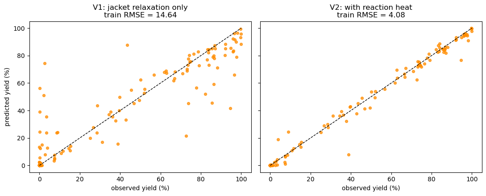
</p>

V1 leaves large false-positive errors on runs whose true yield is near 0 % (the over-processed regime). V2 collapses these onto the parity line: training RMSE falls from 14.64 to **4.08** and R&sup2; rises from 0.854 to **0.989**. The cross-validated RMSE of 4.65 confirms that the fit is not overfitting.

---

## 5. Process Insights

### 5.1 What V2 says happens inside the tube

<p align="center">
  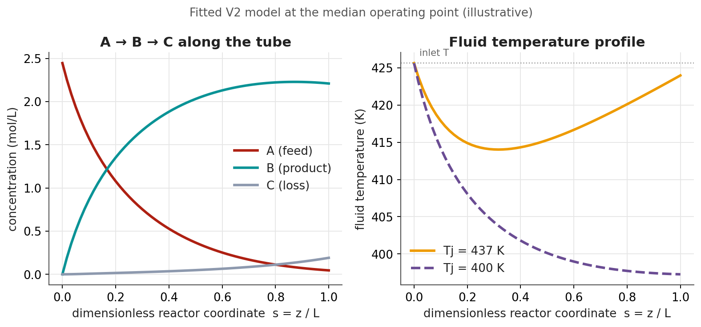
</p>

*Fitted V2 model evaluated at the training-median operating point (illustrative).*

- **B is a transient product.** It peaks near the outlet and begins to decline as C accumulates, which is the series-reaction hump seen in the raw data.
- **The fitted heat terms have opposite signs** (`h1 = -11.1`, `h2 = +14.4`). The first step behaves as endothermic and the second as exothermic. The temperature trace shows this directly: an early dip followed by self-heating as B converts to C.
- That self-heating **accelerates the loss reaction precisely when B is most abundant**, which makes the trade-off between producing B and losing B so sharp.

### 5.2 Kinetic selectivity versus temperature

<p align="center">
  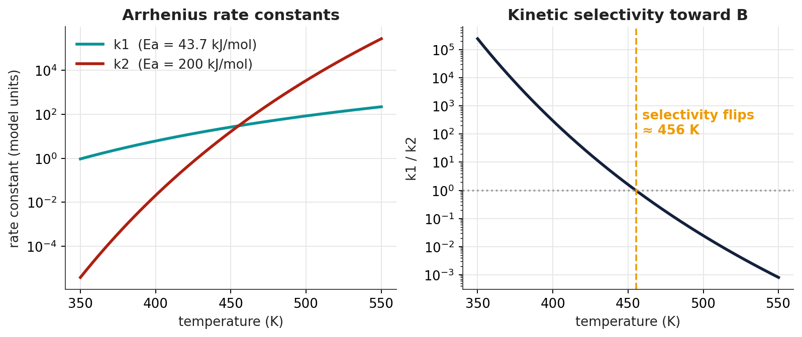
</p>

The loss reaction has a much higher fitted activation energy than the desired one, so `k2` overtakes `k1` near **456 K**. Beyond that point each increment of heat destroys more product than it creates. See the caveat on `Ea2` in Section 7.

### 5.3 Operating window: yield response surface

<p align="center">
  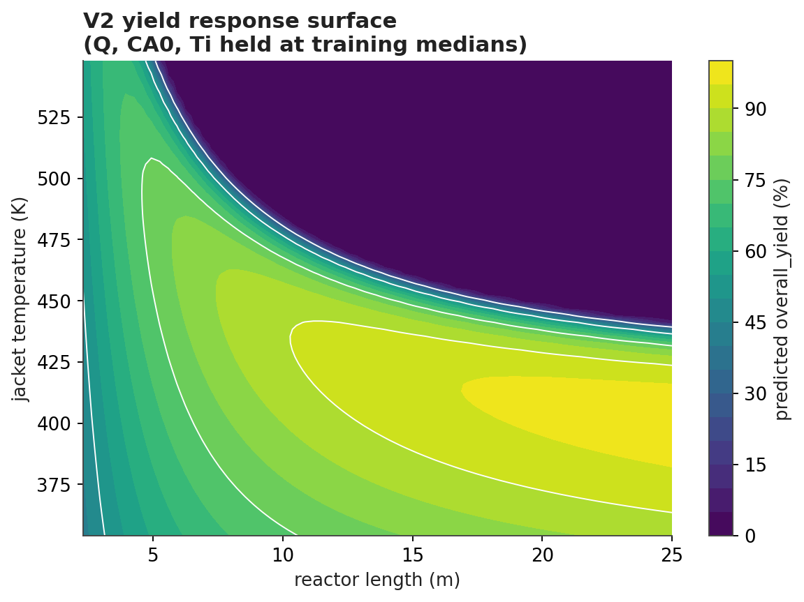
</p>

*Model-generated, with flow rate, feed concentration and inlet temperature held at training medians.*

- A **high-yield ridge** sits at moderate jacket temperature (about 400 to 425 K) and long reactor length.
- Above roughly 450 K there is a sharp **over-processing cliff** where yield collapses to about 0 %. This is consistent with the roughly 43 % of training runs that fall in the lowest yield bin.
- Shorter tubes need hotter jackets to compensate, but only within a narrow band before the cliff.

---

## 6. Negative Result (Retained Deliberately)

A common idea is a **hybrid model**: keep the physics and let ML learn the residual. It was tested on V1 without leakage (per-fold V1 constants, training residuals, ridge on degree-2 polynomial features, added to the held-out prediction).

| Model | CV RMSE |
|---|:---:|
| V1 alone | 14.242 |
| V1 with ML residual corrector | 14.671 (worse) |

Together with near-zero residual-to-input correlations (all absolute values below 0.09), this shows the missing ingredient was **not statistical flexibility but missing physics**, namely the internal energy balance. That diagnosis directly motivated V2. It also confirms that for first-order kinetics the percentage yield is independent of `C_A0` under V1: a free reaction order on `C_A0` moved RMSE only from about 14.6 to about 14.3, no better than one extra parameter fitting noise.

---

## 7. Limitations

- **Validity envelope.** The model is calibrated on 150 runs and is only guaranteed within the training range of operating conditions. Several test points predict at the lower physical bound (0 %); such out-of-envelope points should be flagged and reviewed before use.
- **Parameter at a bound.** The fitted `Ea2` sits exactly on its upper search bound (200 kJ/mol). This points to weak identifiability of the loss-reaction activation energy from this data. The selectivity crossover in Section 5.2 should be read qualitatively, and the bound should be widened and re-tested.
- **Lumped constants.** `c0`, `c1`, `h1` and `h2` absorb unmeasured geometry and thermal properties. Treat them as effective calibration constants, not exact physical quantities.
- **Model assumptions.** First-order kinetics and ideal plug flow (no axial back-mixing or radial gradients).
- **Uncertainty.** Predictions are point estimates; confidence intervals are not yet provided.

---

## 8. Future Work

| Direction | Description |
|---|---|
| Uncertainty quantification | Bootstrap resampling or profile likelihood for parameter and prediction intervals |
| Identifiability and sensitivity | Jacobian-based and Sobol global sensitivity analysis; re-fit with relaxed `Ea2` bounds |
| Stronger data-driven benchmarks | Gradient boosting and Gaussian-process regression |
| Physics-informed hybrids | Learned closures inside the ODE (universal differential equations, neural-ODE residuals) |
| Out-of-distribution guardrails | Input-range monitoring and drift detection for production use |
| Model-based optimisation | Use V2 as a fast surrogate to search for the yield-maximising operating point |

---

## 9. Repository Structure

```
Reactor_AI/
|-- Chemical_Solution.ipynb      full analysis: EDA, baselines, V1, V2, CV, predictions
|-- README.md
|-- requirements.txt
|-- .gitignore
`-- assets/
    |-- animated/                SVG components used in this README
    |   |-- hero.svg
    |   |-- compare.svg
    |   |-- kpis.svg
    |   |-- leaderboard.svg
    |   `-- reactor.svg
    |-- 01_pipeline.png
    |-- 03_cv_fold_stability.png
    |-- 04_reactor_profiles.png
    |-- 05_arrhenius_selectivity.png
    |-- 06_yield_response_surface.png
    |-- 07_eda_distribution.png
    `-- 08_parity_v1_vs_v2.png
```

## 10. Reproduce

```bash
git clone https://github.com/DebasishKaran-1/Reactor_AI.git
cd Reactor_AI
pip install -r requirements.txt
```

The notebook reads the challenge CSVs from a folder named `Reactor AI/`:

```
Reactor AI/train_dataset.csv     150 rows: 5 features + overall_yield
Reactor AI/test_dataset.csv      50 rows: 5 features
```

Run `jupyter notebook Chemical_Solution.ipynb`. Executing all cells refits V1 and V2 (multi-start), performs the 10-fold CV, and writes `reactor_yield_predictions.csv` (50 rows, single `overall_yield` column). Seeds are fixed for reproducibility. The V2 multi-start fit and its CV loop are the slowest cells.

## 11. Methods and Tooling

| Area | Tools and concepts |
|---|---|
| Modelling paradigm | Grey-box and mechanistic modelling, hybrid physics and ML, scientific machine learning |
| Reaction engineering | Plug-flow reactor (PFR), consecutive first-order kinetics, Arrhenius temperature dependence, coupled mass and energy balances, selectivity versus temperature |
| Numerics | Vectorised fixed-step RK4 integration, removable-singularity handling |
| Parameter estimation | Bounded trust-region non-linear least squares, Sobol quasi-Monte-Carlo multi-start, re-parameterisation for conditioning |
| Validation | 10-fold CV with in-fold refitting, fold-level stability analysis, ablation including a negative result |
| Stack | Python, NumPy, SciPy, pandas, scikit-learn, Matplotlib |

---

<p align="center"><b>When data is scarce and the mechanism is known, encode the mechanism.</b><br/>
Eight physically meaningful parameters outperformed a 126-term polynomial by roughly 6x, and explain why the reactor behaves as it does.</p>
